# 关于我的广东移动家庭宽带被透明代理的问题

已初步证实：广东移动可能使用透明代理来减少国际出口流量的成本。当某台设备经常访问国际网站时，运营商可能会记住此设备，对此设备开启“国际访问优化”，将其国际出口流量透明代理至香港某数据中心。运营商从未告知用户此更改，为我造成了诸多麻烦。

注意！以下所有情况仅限于我家的家庭宽带，离开我的家庭网络（使用数据、连接其他地方的网络）不会引发此状况。

## 前言

最近几个月，我被家里的网络折磨得不行。我的家庭宽带运营商是广东移动，非公司内网，更不是校园网。自2025年10月份依赖，我的电脑开始出现居多网络方面的问题。（电脑是8月份新买的）主要问题为：

可以在浏览器中访问诸多国外的网站、某些应用的网络连接经常失败。在10月份时，我偶然发现我的电脑可以在不开启任何代理的情况下访问诸多国外的网站，诸如：Google搜索以及其他Google服务网站、Discord、Twitter...（浏览器不包含或未启用任何具有代理功能的扩展）而某些应用的网络请求时而受阻。

## 研究历程

由于我在上大学，使用家庭网络的情况并不多，但几次周末回家之时，还是潜心研究了这个问题。以下列出了详细信息：

1.  若使用运营商提供的DNS，则不能访问这些网站。若切换到国际的DNS，如1.1.1.1 (Cloudflare DNS)或8.8.8.8 (Google DNS)，则可以访问这些网站。可判定是运营商的DNS阻断，若不使用自动配置的DNS，则可规避此阻断。至于某防火墙的其他阻断为何失效，我无法推测，可能是某些难以解释的技术问题。

2.  某些ip测量网站会显示本机为香港ip。在多个本机ip测量网站中，某些网站可能显示电脑的ipv4在香港。此ipv4属于UCloud某数据中心，此ipv4只会在两个ipv4之间选择，它们在最后一位只相差1。这两个ipv4地址是：156.242.127.17和126.242.127.18。ipv6测量均显示在广东。

    以下列出了某ip测量网站显示的测量结果（ipv6已被遮挡）：

    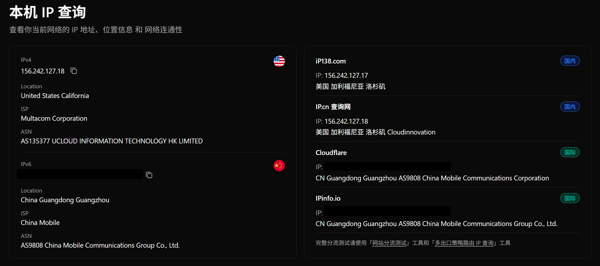

3.  浏览器打开Google搜索会被重定向到[https://www.google.com.hk/](https://www.google.com.hk/)，并根据此设备ip显示地理位置在中国广东。在修改DNS为上述DNS后，初次打开Google搜索（或其他网站），可能会显示连接超时、连接已重置，这是国内访问此网站的正常情况。（然而，我的浏览器不一定显示此信息）。等待加载一段时间，似乎在进行某些网络跳转，突然，浏览器就连接到了服务器，成功显示出Google搜索界面。浏览器可能进行了缓存，自此以后，打开Google搜索界面都很快，几乎是迅速跳转。访问[htts://www.google.com](https://www.google.com/)需要等待片刻，随后被重定向到[https://www.google.com.hk/](https://www.google.com.hk/)。

    值得注意的是，此时Google搜索界面与正常在香港访问的界面有些许不同。通常情况下，Google搜索的图标会有季节性样式，并在页面左下方（左下角）标注区域，与本机ip区域对应。但此时我的左下角并未标注区域。如果进行搜索，则会在左下角显示位置（位置与区域不同，区域是Google用于修改网页行为的一项设置，而位置只是Google返回的一个位置信息）广东省 中国 - 是根据您的IP地址推断出来的。我的ip当然不能直接访问Google服务，一定是被代理到了香港之后才能访问的。我猜测Google可能通过某些方法溯源，或是根据我的ipv6（不太可能）来推断的。以下展示了访问状况截图。

    直接访问时：

    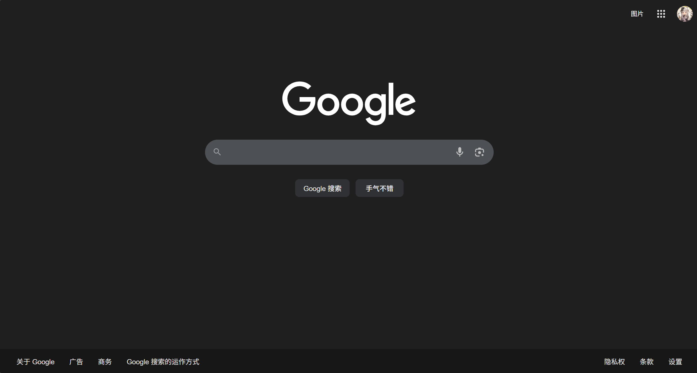

    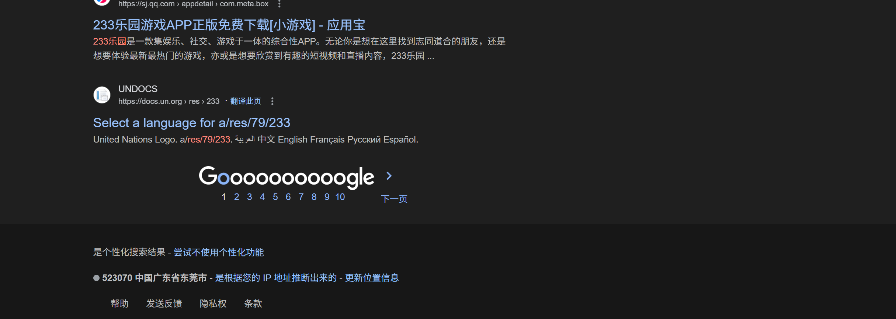

    开启VPN访问时：

    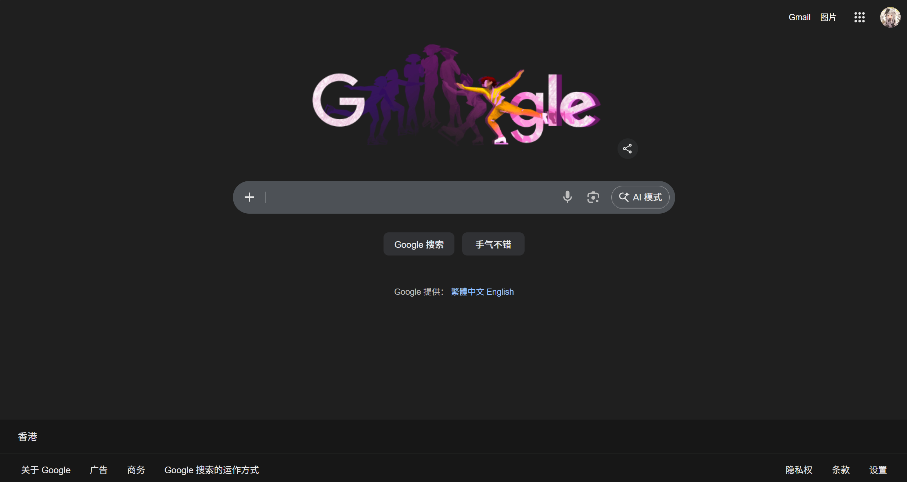

    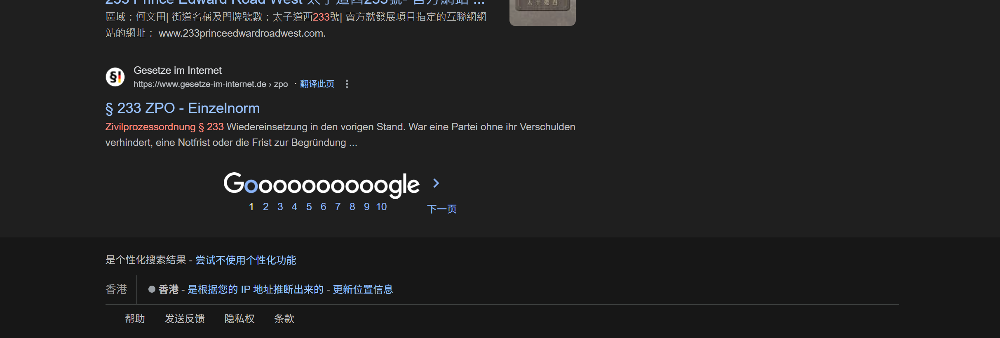

4.  浏览器打开必应搜索经常会提示“当前无法使用此页面：www.bing.com 重定向你太多次。”以下展示了访问状况截图：

    未截获

    即使等待很长时间也会停留在此页面。浏览器指示“尝试删除此网站的Cookie”，我当然尝试过这个指示，但无济于事。百度搜索永远不会作为我的主要搜索引擎，因此我有时甚至还需要使用Google搜索。

5.  只有特定设备才会出现此情况。除了我的电脑，我还尝试过其他设备，包括我的手机，家人的手机。我的手机同样出现了上述状况。我家人的手机和另一台电脑均显示本机ip在中国。经过研究，我发现透明代理的设置与设备硬件地址（mac地址）设置相关，此结论将在后续说明。

    值得注意的是，即使使用运营商分配的DNS，在我的手机中，Google play应用也能连接上服务器。我的手机安装了Google play服务，能直接打开Play商店，信息能加载、图片能显示。Google play商店可能采用了另类网络连接设置。这当然不是app缓存，因为这些信息都是能刷新的，但就是下载不了东西。

------

可以在浏览器中访问诸多国外的网站，并不代表其他应用也能访问这些网站。例如，使用终端Powershell的curl获取网站内容就会失败。更奇怪的是，即使某些连接是合法的，如应用的api连接，也可能会失败，然后可能返回错误：SSL连接无法建立。以下展示了某些应用访问失败时的情况：

1.  osu!lazer客户端无法连接服务器

    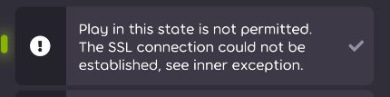

    ```log
    ----------------------------------------------------------
    network Log (LogLevel: Verbose)
    Running osu 2026.130.0.0 on .NET 8.0.16
    Environment: Windows (Microsoft Windows NT 10.0.26200.0), 24 cores 
    ----------------------------------------------------------
    ...
    2026-02-04 05:23:06 [verbose]: Performing request osu.Game.Online.API.Requests.GetMeRequest
    2026-02-04 05:23:07 [verbose]: Request to https://osu.ppy.sh/api/v2/me/ failed with System.Net.Http.HttpRequestException: The SSL connection could not be established, see inner exception.
    2026-02-04 05:23:07 [verbose]: ---> System.Security.Authentication.AuthenticationException: Authentication failed because the remote party sent a TLS alert: 'ProtocolVersion'.
    2026-02-04 05:23:07 [verbose]: ---> System.ComponentModel.Win32Exception (0x80090326): 接收到的消息异常，或格式不正确。
    2026-02-04 05:23:07 [verbose]: --- End of inner exception stack trace ---
    2026-02-04 05:23:07 [verbose]: at System.Net.Security.SslStream.ForceAuthenticationAsync[TIOAdapter](Boolean receiveFirst, Byte[] reAuthenticationData, CancellationToken cancellationToken)
    2026-02-04 05:23:07 [verbose]: at System.Net.Http.ConnectHelper.EstablishSslConnectionAsync(SslClientAuthenticationOptions sslOptions, HttpRequestMessage request, Boolean async, Stream stream, CancellationToken cancellationToken)
    2026-02-04 05:23:07 [verbose]: --- End of inner exception stack trace ---
    2026-02-04 05:23:07 [verbose]: at System.Net.Http.ConnectHelper.EstablishSslConnectionAsync(SslClientAuthenticationOptions sslOptions, HttpRequestMessage request, Boolean async, Stream stream, CancellationToken cancellationToken)
    2026-02-04 05:23:07 [verbose]: at System.Net.Http.HttpConnectionPool.ConnectAsync(HttpRequestMessage request, Boolean async, CancellationToken cancellationToken)
    2026-02-04 05:23:07 [verbose]: at System.Net.Http.HttpConnectionPool.CreateHttp11ConnectionAsync(HttpRequestMessage request, Boolean async, CancellationToken cancellationToken)
    2026-02-04 05:23:07 [verbose]: at System.Net.Http.HttpConnectionPool.AddHttp11ConnectionAsync(QueueItem queueItem)
    2026-02-04 05:23:07 [verbose]: at System.Threading.Tasks.TaskCompletionSourceWithCancellation`1.WaitWithCancellationAsync(CancellationToken cancellationToken)
    2026-02-04 05:23:07 [verbose]: at System.Net.Http.HttpConnectionPool.SendWithVersionDetectionAndRetryAsync(HttpRequestMessage request, Boolean async, Boolean doRequestAuth, CancellationToken cancellationToken)
    2026-02-04 05:23:07 [verbose]: at System.Net.Http.AuthenticationHelper.SendWithAuthAsync(HttpRequestMessage request, Uri authUri, Boolean async, ICredentials credentials, Boolean preAuthenticate, Boolean isProxyAuth, Boolean doRequestAuth, HttpConnectionPool pool, CancellationToken cancellationToken)
    2026-02-04 05:23:07 [verbose]: at System.Net.Http.RedirectHandler.SendAsync(HttpRequestMessage request, Boolean async, CancellationToken cancellationToken)
    2026-02-04 05:23:07 [verbose]: at System.Net.Http.DecompressionHandler.SendAsync(HttpRequestMessage request, Boolean async, CancellationToken cancellationToken)
    2026-02-04 05:23:07 [verbose]: at System.Net.Http.HttpClient.<SendAsync>g__Core|83_0(HttpRequestMessage request, HttpCompletionOption completionOption, CancellationTokenSource cts, Boolean disposeCts, CancellationTokenSource pendingRequestsCts, CancellationToken originalCancellationToken)
    2026-02-04 05:23:07 [verbose]: at osu.Framework.IO.Network.WebRequest.internalPerform(CancellationToken cancellationToken).
    2026-02-04 05:23:07 [verbose]: Failing request osu.Game.Online.API.Requests.GetMeRequest (System.Net.Http.HttpRequestException: The SSL connection could not be established, see inner exception.
    2026-02-04 05:23:07 [verbose]: ---> System.Security.Authentication.AuthenticationException: Authentication failed because the remote party sent a TLS alert: 'ProtocolVersion'.
    2026-02-04 05:23:07 [verbose]: ---> System.ComponentModel.Win32Exception (0x80090326): 接收到的消息异常，或格式不正确。
    2026-02-04 05:23:07 [verbose]: --- End of inner exception stack trace ---
    2026-02-04 05:23:07 [verbose]: at System.Net.Security.SslStream.ForceAuthenticationAsync[TIOAdapter](Boolean receiveFirst, Byte[] reAuthenticationData, CancellationToken cancellationToken)
    2026-02-04 05:23:07 [verbose]: at System.Net.Http.ConnectHelper.EstablishSslConnectionAsync(SslClientAuthenticationOptions sslOptions, HttpRequestMessage request, Boolean async, Stream stream, CancellationToken cancellationToken)
    2026-02-04 05:23:07 [verbose]: --- End of inner exception stack trace ---
    2026-02-04 05:23:07 [verbose]: at System.Net.Http.ConnectHelper.EstablishSslConnectionAsync(SslClientAuthenticationOptions sslOptions, HttpRequestMessage request, Boolean async, Stream stream, CancellationToken cancellationToken)
    2026-02-04 05:23:07 [verbose]: at System.Net.Http.HttpConnectionPool.ConnectAsync(HttpRequestMessage request, Boolean async, CancellationToken cancellationToken)
    2026-02-04 05:23:07 [verbose]: at System.Net.Http.HttpConnectionPool.CreateHttp11ConnectionAsync(HttpRequestMessage request, Boolean async, CancellationToken cancellationToken)
    2026-02-04 05:23:07 [verbose]: at System.Net.Http.HttpConnectionPool.AddHttp11ConnectionAsync(QueueItem queueItem)
    2026-02-04 05:23:07 [verbose]: at System.Threading.Tasks.TaskCompletionSourceWithCancellation`1.WaitWithCancellationAsync(CancellationToken cancellationToken)
    2026-02-04 05:23:07 [verbose]: at System.Net.Http.HttpConnectionPool.SendWithVersionDetectionAndRetryAsync(HttpRequestMessage request, Boolean async, Boolean doRequestAuth, CancellationToken cancellationToken)
    2026-02-04 05:23:07 [verbose]: at System.Net.Http.AuthenticationHelper.SendWithAuthAsync(HttpRequestMessage request, Uri authUri, Boolean async, ICredentials credentials, Boolean preAuthenticate, Boolean isProxyAuth, Boolean doRequestAuth, HttpConnectionPool pool, CancellationToken cancellationToken)
    2026-02-04 05:23:07 [verbose]: at System.Net.Http.RedirectHandler.SendAsync(HttpRequestMessage request, Boolean async, CancellationToken cancellationToken)
    2026-02-04 05:23:07 [verbose]: at System.Net.Http.DecompressionHandler.SendAsync(HttpRequestMessage request, Boolean async, CancellationToken cancellationToken)
    2026-02-04 05:23:07 [verbose]: at System.Net.Http.HttpClient.<SendAsync>g__Core|83_0(HttpRequestMessage request, HttpCompletionOption completionOption, CancellationTokenSource cts, Boolean disposeCts, CancellationTokenSource pendingRequestsCts, CancellationToken originalCancellationToken)
    2026-02-04 05:23:07 [verbose]: at osu.Framework.IO.Network.WebRequest.internalPerform(CancellationToken cancellationToken))
    2026-02-04 05:23:07 [verbose]: HttpRequestException while performing request osu.Game.Online.API.Requests.GetMeRequest: The SSL connection could not be established, see inner exception.
    2026-02-04 05:23:07 [verbose]: API failure count is now 75
    2026-02-04 05:23:07 [verbose]: APIAccess is in a failing state, waiting a bit before we try again...
    ```

    可以看到，应用一直在尝试连接服务器，但连接无法建立。.NET平台的HttpClient向我们展示了调用堆栈，核心错误是SSL连接无法建立。当然，这并不是必定发生的，连接状态时而成功时而失败。

    你可能会怀疑这是应用的问题，所以我使用c#编写了一个简单的Get网址程序。（使用.NET 9平台）代码如下：

    ```c#
    namespace MyNamespace;

    public class Program
    {
        public static async Task Main(string[] args)
        {
            using HttpClient client = new HttpClient();
            var response = await client.GetAsync("https://auth.ppy.sh/updates/get");
            Console.WriteLine($"Status Code: {response.StatusCode}");
            Console.WriteLine($"Is Success: {response.IsSuccessStatusCode}");
        }
    }
    ```

    运行时程序在client.GetAsync一行报错。

    连接网址为[https://auth.ppy.sh/updates/get](https://auth.ppy.sh/updates/get)的错误详细信息：

    ```log
    System.Net.Http.HttpRequestException
    HResult=0x80131501
    Message=The SSL connection could not be established, see inner exception.
    Source=System.Net.Http
    StackTrace:
    at System.Net.Http.ConnectHelper.<EstablishSslConnectionAsync>d__2.MoveNext()
    at System.Runtime.CompilerServices.ConfiguredValueTaskAwaitable`1.ConfiguredValueTaskAwaiter.GetResult()
    at System.Net.Http.HttpConnectionPool.<ConnectAsync>d__51.MoveNext()
    at System.Runtime.CompilerServices.ConfiguredValueTaskAwaitable`1.ConfiguredValueTaskAwaiter.GetResult()
    at System.Net.Http.HttpConnectionPool.<CreateHttp11ConnectionAsync>d__80.MoveNext()
    at System.Runtime.CompilerServices.ConfiguredValueTaskAwaitable`1.ConfiguredValueTaskAwaiter.GetResult()
    at System.Net.Http.HttpConnectionPool.<InjectNewHttp11ConnectionAsync>d__79.MoveNext()
    at System.Threading.Tasks.TaskCompletionSourceWithCancellation`1.<WaitWithCancellationAsync>d__1.MoveNext()
    at System.Runtime.CompilerServices.ConfiguredValueTaskAwaitable`1.ConfiguredValueTaskAwaiter.GetResult()
    at System.Net.Http.HttpConnectionWaiter`1.<WaitForConnectionWithTelemetryAsync>d__6.MoveNext()
    at System.Runtime.CompilerServices.ConfiguredValueTaskAwaitable`1.ConfiguredValueTaskAwaiter.GetResult()
    at System.Net.Http.HttpConnectionPool.<SendWithVersionDetectionAndRetryAsync>d__50.MoveNext()
    at System.Runtime.CompilerServices.ConfiguredValueTaskAwaitable`1.ConfiguredValueTaskAwaiter.GetResult()
    at System.Net.Http.RedirectHandler.<SendAsync>d__4.MoveNext()
    at System.Net.Http.HttpClient.<<SendAsync>g__Core|83_0>d.MoveNext()
    at MyNamespace.Program.<Main>d__0.MoveNext() in D:\Common folders\Development\myfunnyproject\HttpClientTestCorrect\Program.cs:line 13
    at MyNamespace.Program.<Main>(String[] args)

    Inner Exception 1:
    AuthenticationException: Authentication failed because the remote party sent a TLS alert: 'ProtocolVersion'.

    Inner Exception 2:
    Win32Exception: 接收到的消息异常，或格式不正确。
    ```

    连接网址为[https://www.google.com.hk](https://www.google.com.hk/)的错误详细信息：

    ```log
    System.Net.Http.HttpRequestException
    HResult=0x80131620
    Message=The SSL connection could not be established, see inner exception.
    Source=System.Net.Http
    StackTrace:
    at System.Net.Http.ConnectHelper.<EstablishSslConnectionAsync>d__2.MoveNext()
    at System.Runtime.CompilerServices.ConfiguredValueTaskAwaitable`1.ConfiguredValueTaskAwaiter.GetResult()
    at System.Net.Http.HttpConnectionPool.<ConnectAsync>d__51.MoveNext()
    at System.Runtime.CompilerServices.ConfiguredValueTaskAwaitable`1.ConfiguredValueTaskAwaiter.GetResult()
    at System.Net.Http.HttpConnectionPool.<CreateHttp11ConnectionAsync>d__80.MoveNext()
    at System.Runtime.CompilerServices.ConfiguredValueTaskAwaitable`1.ConfiguredValueTaskAwaiter.GetResult()
    at System.Net.Http.HttpConnectionPool.<InjectNewHttp11ConnectionAsync>d__79.MoveNext()
    at System.Threading.Tasks.TaskCompletionSourceWithCancellation`1.<WaitWithCancellationAsync>d__1.MoveNext()
    at System.Runtime.CompilerServices.ConfiguredValueTaskAwaitable`1.ConfiguredValueTaskAwaiter.GetResult()
    at System.Net.Http.HttpConnectionWaiter`1.<WaitForConnectionWithTelemetryAsync>d__6.MoveNext()
    at System.Runtime.CompilerServices.ConfiguredValueTaskAwaitable`1.ConfiguredValueTaskAwaiter.GetResult()
    at System.Net.Http.HttpConnectionPool.<SendWithVersionDetectionAndRetryAsync>d__50.MoveNext()
    at System.Runtime.CompilerServices.ConfiguredValueTaskAwaitable`1.ConfiguredValueTaskAwaiter.GetResult()
    at System.Net.Http.RedirectHandler.<SendAsync>d__4.MoveNext()
    at System.Net.Http.HttpClient.<<SendAsync>g__Core|83_0>d.MoveNext()
    at MyNamespace.Program.<Main>d__0.MoveNext() in D:\Common folders\Development\myfunnyproject\HttpClientTestCorrect\Program.cs:line 13
    at MyNamespace.Program.<Main>(String[] args)

    This exception was originally thrown at this call stack:
        System.Net.Security.SslStream.ReceiveHandshakeFrameAsync<TIOAdapter>(System.Threading.CancellationToken)
        System.Runtime.CompilerServices.ConfiguredValueTaskAwaitable<TResult>.ConfiguredValueTaskAwaiter.GetResult()
        System.Net.Security.SslStream.ForceAuthenticationAsync<TIOAdapter>(bool, byte[], System.Threading.CancellationToken)
        System.Net.Security.SslStream.ProcessAuthenticationWithTelemetryAsync(bool, System.Threading.CancellationToken)
        System.Net.Http.ConnectHelper.EstablishSslConnectionAsync(System.Net.Security.SslClientAuthenticationOptions, System.Net.Http.HttpRequestMessage, bool, System.IO.Stream, System.Threading.CancellationToken)

    Inner Exception 1:
    IOException: Received an unexpected EOF or 0 bytes from the transport stream.
    ```

    上述的几篇日志中，错误消息有明显的字眼：The SSL connection could not be established, see inner exception. 这是.NET平台的HttpClient发出Get请求的统一样式。

    连接其他已知网址（使用.NET的HttpClient，而非浏览器）如[https://discord.com](https://discord.com)、[https://youtube.com](https://youtube.com)，则会显示：“由于连接方在一段时间后没有正确答复或连接的主机没有反应，连接尝试失败。”这是在国内访问这些网站的正常现象。

    以下为运行时错误信息的截图。

    验证失败，因为远程方发送了TLS警告：‘协议版本’。

    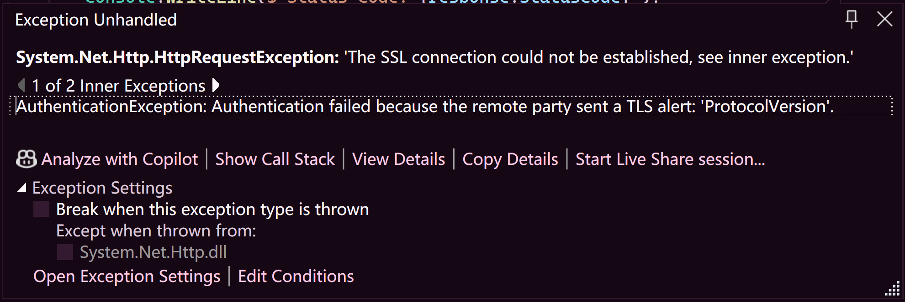

    接收到的消息异常，或格式不正确。

    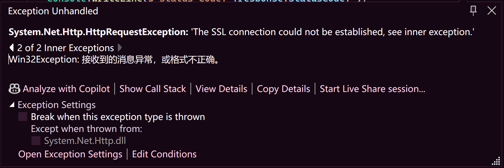

    调用堆栈：

    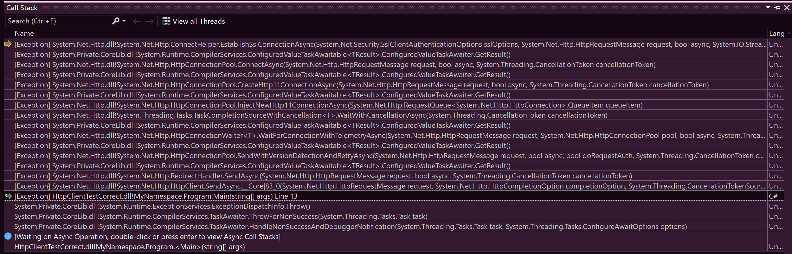

2.  HMCL无法登录正版账户。

    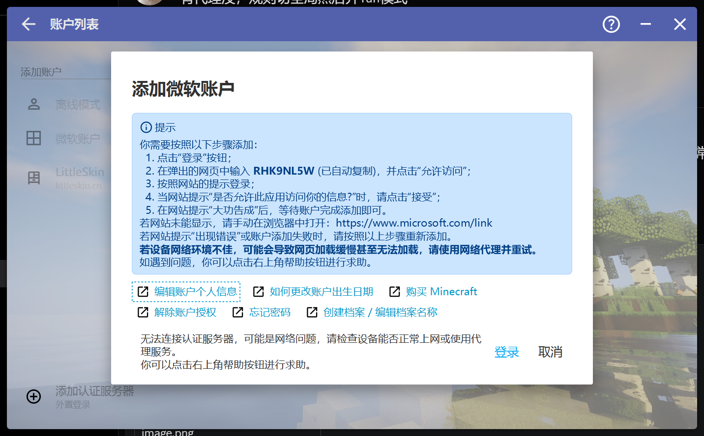

    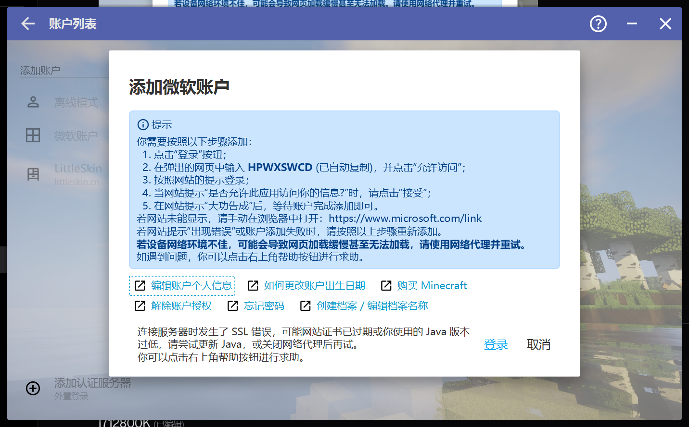

3.  Minecraft提示“玩家档案公钥丢失”。玩家档案公钥丢失，与SSL连接（RSA加密）存在高度相关性，因而在此贴出。

    

------

## 运营商识别特定设备的方式

目前已知运营商只会对特定设备进行透明代理。然而，我对他们识别设备的方式尚不清楚。你可能联想到设备的硬件地址（mac地址），这是区分不同设备的一个方式。确实，我发现他们识别设备的方式与硬件地址设置相关，因为一旦我修改网络连接中的随机硬件地址设置，透明代理的现象会随之消失和出现。然而，并不是我将设置切换到“关闭随机硬件地址”，现象会消失，而是切换了，现象会消失和出现。为什么我这么说？我的电脑此前一直是“关闭随机硬件地址”的状态，切换到“打开随机硬件地址”，现象会消失；再切换回来，现象重现。而我的手机此前一直是“开启随机硬件地址”的状态，切换到“关闭随机硬件地址”，现象会消失；再切换回来，现象重现。此结论已经过多次反复验证。按照常理，本应是固定的硬件地址才能被锁定，但我的手机情况竟然与之相反。由于我没有更多的设备进行此项测试，因此暂无法定论。

## 所有访问情况列表

为了直观理解内容，以下列出了相关信息表格。

以下表格列出了设备网络连接情况。

|设备                  |手机                        |电脑                        |
|---                  |---                         |---                         |
|使用随机MAC           |被代理，但不具备绕过能力      |不会被代理                   |
|使用设备MAC           |不会被代理                   |被代理，但不具备绕过能力      |
|使用随机MAC，并修改DNS |被代理，具备绕过能力          |不会被代理                  |
|使用设备MAC，并修改DNS |不会被代理                   |被代理，具备绕过能力         |

以下表格列出了在被代理时，一些网站的访问情况。

|标识                      |不具备绕过能力        |具备绕过能力                   |
|---                      |---                  |---                          |
|[https://www.google.com](https://www.google.com)    |×连接被中断          |√被重定向到hk地址               |
|[https://www.google.com.hk](https://www.google.com.hk) |×连接被中断          |√正常访问                      |
|[https://youtube.com](https://youtube.com)       |×连接被中断          |√正常访问                      |
|[https://github.com](https://github.com)        |√正常访问            |√正常访问                      |
|[https://discord.com](https://discord.com)       |×连接被中断          |! 可访问主页，但无法打开频道页面  |
|[https://www.pixiv.net](https://www.pixiv.net)     |×连接被中断          |√正常访问                      |
|[https://open.spotify.com](https://open.spotify.com)  |×连接被中断          |√正常访问                      |
|[https://www.pornhub.com](https://www.pornhub.com)   |×连接被中断          |×连接被中断                    |
|[https://zh.wikipedia.org](https://zh.wikipedia.org)  |×连接被中断          |×连接被中断                    |
|[https://www.reddit.com](https://www.reddit.com)    |×连接被中断          |√正常访问                      |
|[https://grok.com](https://grok.com)          |×连接被中断          |√正常访问                      |
|[https://x.com](https://x.com)             |×连接被中断          |√能访问，但不稳定               |
|[https://copilot.microsoft.com](https://copilot.microsoft.com) |×连接被中断      |√正常访问                      |
|[https://store.steampowered.com](https://store.steampowered.com) |√正常访问       |√正常访问                      |
|[https://web.telegram.org](https://web.telegram.org)  |×连接被中断          |√正常访问                      |

以下表格列出了在被代理时，一些APP的访问情况。由于APP一般会使用自己的网络连接方式（自己的DNS域名解析方式），因此修改系统设置通常不会影响其网络连接。

|标识       |不具备绕过能力        |具备绕过能力          |
|---        |---                 |---                  |
|[Play商店](https://play.google.com/ "https://play.google.com/")   |! 可以连接网络，图片加载缓慢，无法下载软件|! 可以连接网络，图片加载缓慢，无法下载软件|
|[Youtube](https://www.youtube.com/ "https://www.youtube.com/" )    |×无法连接网络          |×无法连接网络          |
|[Discord](https://discord.com/ "https://discord.com/")    |×无法连接网络          |×无法连接网络          |
|[Telegram](https://web.telegram.org/ "https://web.telegram.org/")   |×无法连接网络          |×无法连接网络          |

## 总结

异常情况可以概括为：浏览器可以打开非法地址；请求某些合法地址和某些非法地址会因SSL连接无法建立而失败。

这种异常情况也并非必然的。有些时候，请求合法地址时也能正常连接；请求非法地址时只会被断开连接，或是连接超时。当然，这仅限桌面应用。浏览器的情况较为稳定，大部分时候浏览器能正常打开非法地址。

显然，运营商在时不时拆解这些应用的https流量，尝试探测其中的内容是否合法。如果运气好，运营商不会拆解，连接能成功；如果运气不好，被运营商拆解了，则很容易失败。他们似乎不能拆解浏览器的连接，但能拆解某些普通应用的连接，以至于windows终端和某些应用可能出现被运营商DPI阻断的情况，即使这些连接是合法的。浏览器的连接为什么不能拆解呢？我猜测可能因为浏览器在某些方面做得较为完善，隐私性更强、连接策略更智能，以至于某防火墙无法有效阻断连接。

那么，运营商究竟知不知道我通过浏览器访问了这些网站呢？他们为降低成本而将用户的家庭宽带代理至香港服务器。那么由此产生的意外阻断失败，是他们真的不知情，还是明知这种可能，却因技术上无法规避而做出的退步？

无论如何，我在意外中获得了访问这些网站的能力，同时也失去了一部分网络的稳定性。在这个过程中，我似乎并没有真正意义上“违法”。代理并非我的主观意愿，而是运营商的管理决策。我没有主动寻求加密代理服务器，更没有私自搭建非法信道。